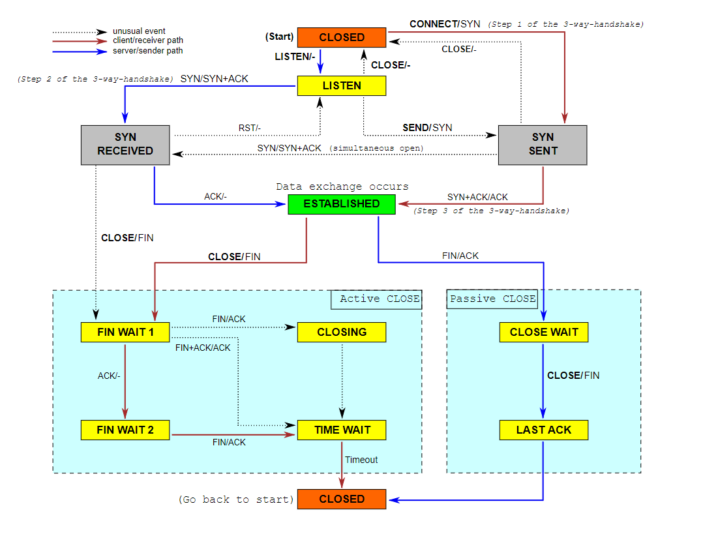

# 4. TCP connection

### 有点疑惑

* TCP连接阶段，发送方和接收方的动作或事件有点不一样，怎么写成一种逻辑，或者怎么区分两种逻辑？而且对于TCP关闭阶段，发送方和接收方也有两套逻辑，难道一个类能同时实现两套操作？？？

  * 看了测试用例后，应该是调用 `connect()` 标识为客户端，否则为服务端
  * 仅多调用一次 `connect()` 就能实现TCP的正确连接
  * 能不能不用某些标志位标记 Client or Server？

  > **The bottom line is that if the TCPConnection’s inbound stream ends before the TCPConnection has ever sent a fin segment, then the TCPConnection doesn’t need to linger after both streams finish.**

* TCP建立连接阶段，对方发送一个 SYN 且带有seqno，本地则需要发回一个 ACK with ackno=seqno+1。但是对方的序号并不会向下传给 `_sender` ，难道需要在外层进行回复？

  * 虽然 `_receiver.ackno()` 可以得到 ackno，但是怎么把这个字段写进 `_sender` 的报文段里？貌似两者也没有可以交互的接口啊？
  * 难道说 `TCPConnection::segments_out()` 就是做这件事的？

